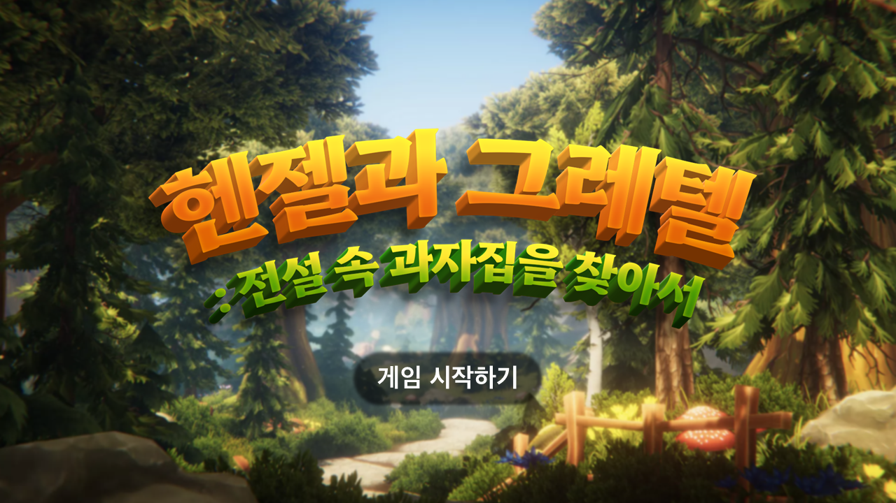

# Unity-VR_HanselAndGretel
VR Storybook Game for Children

# 헨젤과 그레텔 : 전설 속 과자집을 찾아서

<!-- TABLE OF CONTENTS -->

  
목차

  <ol>
    <li>
      <a href="#about-the-project">About the Project</a>
      <ul>
        <li><a href="#built-with">Built with</a></li>
      </ul>
    </li>
    <li>
      <a href="#getting-started">Getting Started</a>
      <ul>
        <li><a href="#installation">Installation</a></li>
      </ul>
    </li>
    <li><a href="#application-contents">Application Contents</a></li>
    <li><a href="#contact">Contact</a></li>
  </ol>

# About the Project

<h4 align="center">헨젤과 그레텔 동화책을 기반으로 코로나로 인한 영유아들의 발달 지연 극복(인지 자극, 사회성 향상)을 위한  
Unity-based VR 스토리북을 제작하는 것을 목표로 한다.  
 
이를 위해서, 스토리의 전개에 있어 플레이어가 간단한 미션을 수행하며 갈등, 도움, 모험의 요소를 체험할 수 있게 해,  
5-9세 아동의 바람직한 사회성 발달에 도움을 줄 수 있도록 한다.</h4>

## Built with
* [![Unity][Unity]][Unity-url] **(2021.3.11f1 LTS)**
* [![Oculus][Oculus]][Oculus-url]
* [![C#][C#]][C#-url]
* [![Visual Studio][Visual Studio]][VS-url]
* [![GitLab][GitLab]][GitLab-url]

# Getting Started

## Installation
### [빌드된 프로젝트 템플릿 다운로드](https://drive.google.com/file/d/1aG-by0jnDPhGn2MWY-r2jGn5eHrKveG5/view?usp=sharing)
### 방법 1. 오큘러스 기기로 옮겨서 실행하기(권장)

### 방법 2. 키보드와 마우스로 즐기기
 - 움직이기 : W, A, S ,D
 - 카메라 회전 : 우클릭 꾹 누른 상태에서 마우스 옮기기
 - 선택 : Z
 - 점프 : SPACE
 - 물건 집기 : X
 - 게임종료 : ALT + F4
키보드와 마우스는 두번째 물건 집기부터 불가능 하다.

(<a href="#readme-top">back to top</a>)

# Application Contents
1. **헨젤 혹은 그레텔: 아동의 연령층에 따라 스토리 선택 지원** 
a. 그레텔 시점 - 타겟 연령층 : 5-7세 유아  
b. 헨젤 시점 - 타겟 연령층 : 초등학교 저학년  
2. **숲 속 모험** 
a. 알맞은 보석 던지기: 다시 마을로 돌아가기 위해 헨젤이 요구하는 보석을 찾아 길에 던지기  
b. 덧셈/뺄셈 연산: 초등학교 1-1 교육과정에 해당하는 연산 문제로 갈림길 선택하기  
3. **과자집 발견 및 새로운 인물과의 갈등** 
a, b 공통 : 과자집 뜯어먹기 & 화난 아이의 표정을 보고 플레이어가 도움을 줄 지 선택지 주어주기  
4. **도움 주고 친구 맺기: 부서져 버린 집을 다시 고치기 위한 재료 찾기 콘텐츠** 
a. 과자집 근처에 찾아야하는 재료 실루엣 or 힌트 식 UI로 보여주고, 해당 재료 찾아서 고쳐주기  
b. 과자집 근처에 찾아야하는 재료를 평면 도안을 보고 해당 평면에 해당하는 입체 도형 찾기  

(<a href="#readme-top">back to top</a>)

# Contact
| 학교     |팀원          |역할       |이메일                     |
|:--------|:------------|:---------|:------------------------|
| 경희대학교 | 김민정       | 프로그래머   |san012@khu.ac.kr|
| 건국대학교 | 남가은       | 디자이너    |tobehappy012@konkuk.ac.kr|
| 경희대학교 | 신동민       | 프로그래머   |shintom1222@khu.ac.kr|
| 경희대학교 | 유민영       | 프로그래머   |mary4998@khu.ac.kr|
| 경희대학교 | 임승현       | 프로그래머   |kevinlsh17@khu.ac.kr|
| 경희대학교 | 장예원       | 프로그래머   |wkddpdnjs99@khu.ac.kr|

(<a href="#readme-top">back to top</a>)

<!-- MARKDOWN LINKS & IMAGES -->

[Unity]: https://img.shields.io/badge/Unity-000000?style=for-the-badge&logo=Unity&logoColor=white
[Unity-url]: https://unity.com/
[C#]:https://img.shields.io/badge/C%20Sharp-239120?style=for-the-badge&logo=C%20sharp&logoColor=white
[C#-url]: https://en.wikipedia.org/wiki/C_Sharp_(programming_language)
[Oculus]: https://img.shields.io/badge/Oculus-1C1E20?style=for-the-badge&logo=Oculus&logoColor=white
[Oculus-url]: https://www.oculus.com/experiences/quest/
[Visual Studio]: https://img.shields.io/badge/Visual%20Studio-5C2D91?style=for-the-badge&logo=Visual%20Studio&logoColor=white
[VS-url]: https://visualstudio.microsoft.com/ko/
[GitLab]: https://img.shields.io/badge/GitLab-FC6D26?style=for-the-badge&logo=GitLab&logoColor=white
[GitLab-url]: https://gitlab.com/

